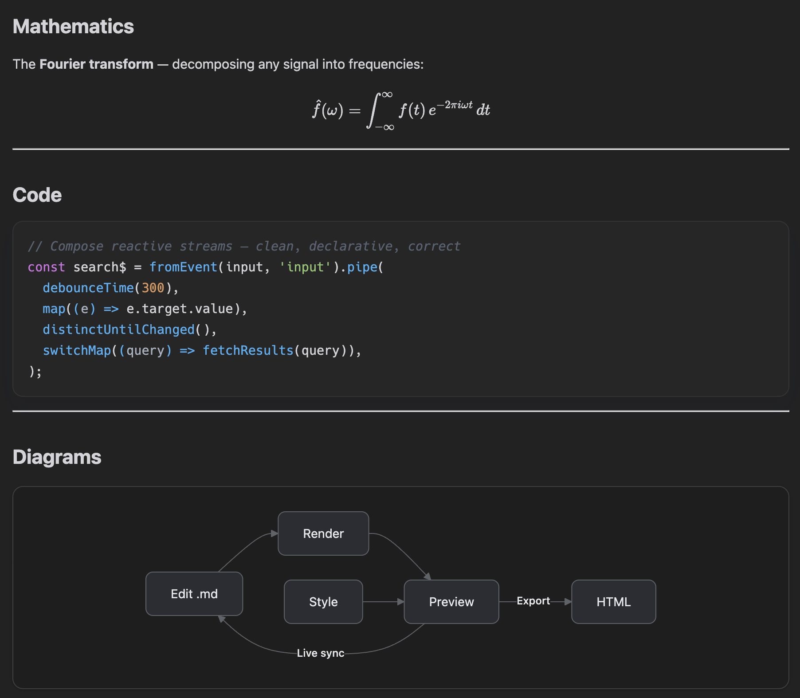
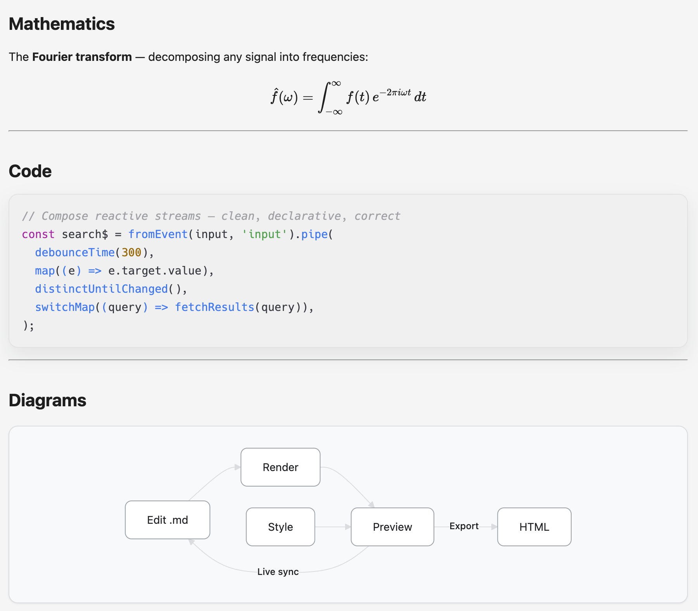

# MDLint

| | |
|:---:|:---:|
|  |  |

A polished Markdown preview extension for VS Code. Open a side panel with live rendering, table of contents, scroll sync, multiple themes, math formulas, code highlighting, and one-click HTML export.

---

## Quick Start

1. Open any `.md` file
2. Click the preview icon in the editor title bar, or run `mdlint: Open Preview` from the Command Palette
3. Switch themes and styles from the floating menu in the preview panel

---

## Features

### Multiple Preview Styles

Choose a look that fits your workflow:

| Style | Description |
|-------|-------------|
| **Default** | Follows your VS Code color theme |
| **GitHub** | Matches GitHub's Markdown rendering |
| **Notion** | Clean, spacious editorial style |
| **Tokyo Night** | Low-contrast dark inspired by the editor theme |
| **Obsidian** | Inspired by the Obsidian app aesthetic |
| **Paper** | Ink on cream paper, print-ready |

Each style supports **Auto / Light / Dark** mode and switches with your VS Code theme when set to Auto.

### Table of Contents & Scroll Sync

- TOC sidebar with automatic heading extraction
- Current section highlight as you scroll
- Click a heading to jump to the editor
- Scroll sync between editor and preview

### Rich Content Support

- **Code highlighting** with copy-to-clipboard buttons
- **Math formulas** via KaTeX (`$...$` inline, `$$...$$` block)
- **Mermaid diagrams** rendered on the fly

### One-Click Export

Export your Markdown to a standalone HTML file with all styles inlined — ready to share or publish.

---

## Settings

Search for `mdlint` in VS Code Settings:

| Setting | Default | Options |
|---------|---------|---------|
| `mdlint.themeMode` | `auto` | `auto` · `light` · `dark` |
| `mdlint.previewStyle` | `default` | `default` · `github` · `notion` · `tokyo-night` · `obsidian` · `paper` |
| `mdlint.showToc` | `true` | `true` · `false` |

---

## Available Commands

- `mdlint: Open Preview` (`mdlint.openPreview`) — Open the preview panel
- `mdlint: Format Document` (`mdlint.formatDocument`) — Clean up Markdown structure
- `mdlint: Refresh TOC` (`mdlint.refreshToc`) — Re-extract headings
- `mdlint: Export HTML` (`mdlint.exportHtml`) — Save as standalone HTML

---

## Changelog

See [CHANGELOG.md](./CHANGELOG.md).

## License

[MIT License](./LICENSE)
