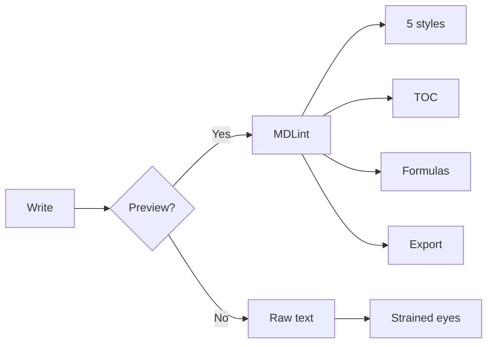
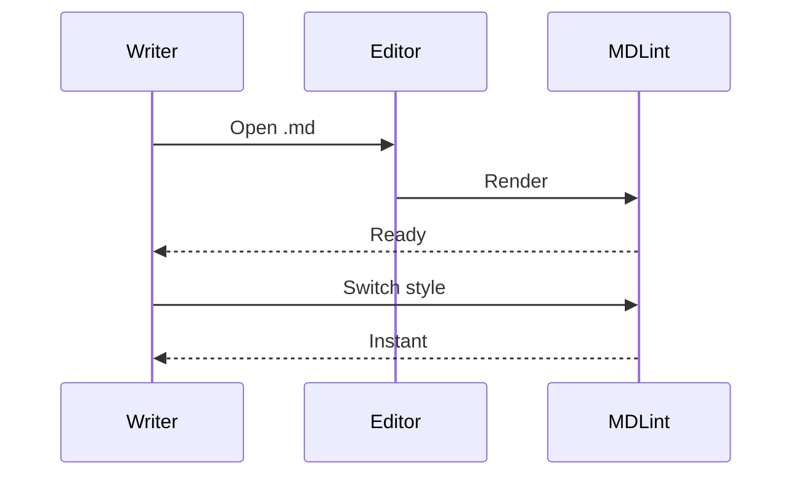

# MDLint

> Markdown preview, reconsidered.

---

## A Style for Every Context

Five distinct visual identities — each designed around a reading experience, not just a palette.

| Style | Character | When to Use |
|-------|-----------|-------------|
| **Default** | Follows your VS Code theme | Everyday authoring |
| **GitHub** | The familiar open-source voice | README, contribution guides |
| **Notion** | Warmth of printed paper | Long-form writing, notes |
| **Tokyo Night** | Calm depth for focused work | Late sessions, dense content |
| **Obsidian** | Structured clarity | Technical wikis, knowledge bases |

---

## Mathematics, Rendered with Precision

Euler's identity — $e^{i\pi} + 1 = 0$ — five constants, one equation, infinite depth.

Maxwell's curl equation:

$$
\nabla \times \mathbf{E} = -\frac{\partial \mathbf{B}}{\partial t}
$$

The QED Lagrangian — the most accurate theory in physics, in a single line:

$$
\mathcal{L} = -\frac{1}{4} F_{\mu\nu}F^{\mu\nu} + \bar{\psi}(i\gamma^\mu D_\mu - m)\psi
$$

---

## Code, Presented with Care

```typescript
// Debounce as a hook — concise, composable, correct
function useDebounce<T>(value: T, delay: number): T {
  const [debounced, setDebounced] = useState(value);
  useEffect(() => {
    const timer = setTimeout(() => setDebounced(value), delay);
    return () => clearTimeout(timer);
  }, [value, delay]);
  return debounced;
}
```

```python
# Flatten any depth, one expression
flatten = lambda x: [i for e in x for i in (flatten(e) if isinstance(e, list) else [e])]
```

```rust
// Zero-copy header parsing — lifetimes doing the heavy lifting
fn parse_header(input: &str) -> IResult<&str, (&str, &str)> {
    let (rest, key) = take_until(":")(input)?;
    let (rest, _) = tag(": ")(rest)?;
    let (rest, value) = take_till(|c| c == '\n')(rest)?;
    Ok((rest, (key, value)))
}
```

---

## Diagrams You Can Interact With





---

## Structure at a Glance

The sidebar extracts your document's outline in real time. Click any heading — arrive there instantly. Long documents stay navigable.

---

## Ship Without Friction

One click exports a self-contained HTML file — styles included, browser-ready, zero dependencies. Write, preview, publish.

---

## The Difference

| Capability | VS Code Native | MDLint |
|-----------|:--------------:|:------:|
| Multiple preview styles | — | 5 |
| Theme auto-adaptation | — | ✓ |
| Sidebar TOC | — | ✓ |
| Mermaid zoom & fullscreen | — | ✓ |
| LaTeX math | ✓ | ✓ |
| Syntax highlighting | ✓ | ✓ 180+ |
| HTML export | — | ✓ |
| Document formatting | — | ✓ |

---

## Getting Started

1. Search **MDLint** in the VS Code Marketplace
2. Install — open any `.md` file
3. Click the preview icon, top-right

```bash
Cmd+Shift+P → "MDLint: Open Preview"
```

---

## Settings

| Key | Values | Default | Purpose |
|-----|--------|---------|---------|
| `mdlint.themeMode` | `auto` · `light` · `dark` | `auto` | Theme behavior |
| `mdlint.previewStyle` | `default` · `github` · `notion` · `tokyo-night` · `obsidian` | `default` | Visual identity |
| `mdlint.showToc` | `true` · `false` | `true` | Sidebar outline |

---

> MDLint — Markdown preview, done right.
