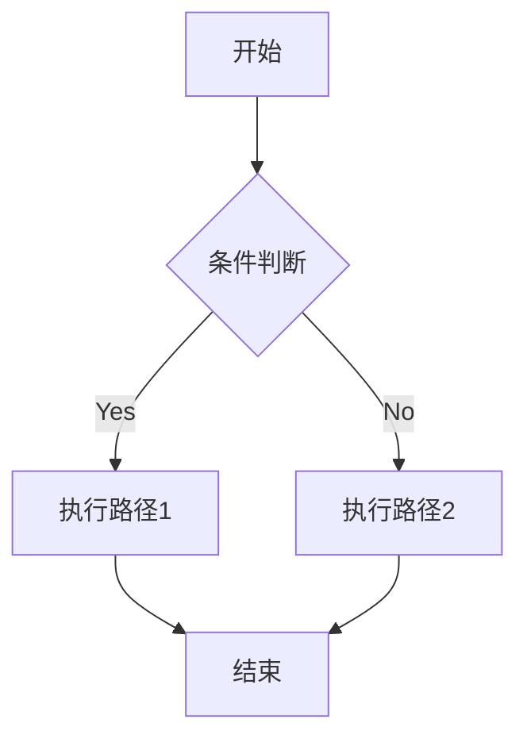
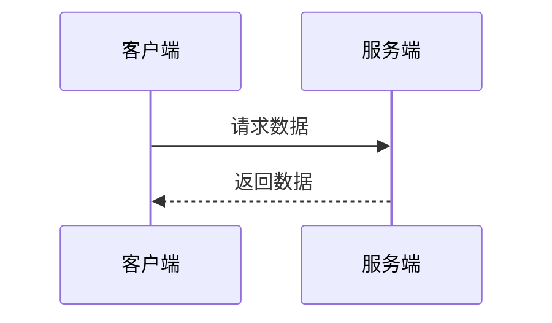

# Markdown 全面测试用例

## 1. 标题层级测试

# H1

## H2

### H3

#### H4

##### H5

###### H6

---

## 2. 文本格式

**粗体**
_斜体_
~~删除线~~
`行内代码`
**_粗斜体_**

> 引用块
>
> > 嵌套引用

---

## 3. 列表

### 无序列表

- 项目 A
  - 子项目 A1
    - 子子项目 A1.1
- 项目 B

### 有序列表

1. 第一项
2. 第二项
   1. 子项 2.1
   2. 子项 2.2

### 任务列表

- [x] 已完成
- [ ] 未完成

---

## 4. 代码块（多语言）

### Go

```go
package main

import "fmt"

func main() {
    fmt.Println("Hello, 世界")
}
```

### Python

```python
def fib(n):
    a, b = 0, 1
    while a < n:
        print(a)
        a, b = b, a + b
```

### JavaScript

```javascript
const asyncFunc = async () => {
    const res = await fetch("https://example.com");
    return res.json();
};
```

### Rust

```rust
fn main() {
    println!("Hello, world!");
}
```

### SQL

```sql
SELECT * FROM users WHERE id = 1;
```

### Bash

```bash
#!/bin/bash
for i in {1..5}; do
  echo $i
done
```

---

## 5. 表格

| 名称 | 类型 | 描述     |
| ---- | ---- | -------- |
| id   | int  | 主键     |
| name | text | 用户名   |
| data | json | 扩展字段 |

---

## 6. 数学公式

行内公式：$E = mc^2$

块级公式：

$$
\int_{a}^{b} x^2 dx = \frac{b^3 - a^3}{3}
$$

复杂公式：

$$
f(x) =
\begin{cases}
x^2 & x < 0 \\
\sqrt{x} & x \ge 0
\end{cases}
$$

---

## 7. URL / 链接

普通链接：
https://example.com/path?query=1&lang=zh#anchor

Markdown 链接：
[OpenAI](https://openai.com)

带标题：
[Example](https://example.com "hover title")

---

## 8. 图片

```markdown

```

---

## 9. HTML 混合

<div style="color:red;">
  HTML 内容 <strong>加粗</strong>
</div>

---

## 10. 转义字符

\*不是斜体\*
\#不是标题

---

## 11. Emoji / Unicode

😀 😎 🚀
中文测试：你好，世界
日文：こんにちは
韩文：안녕하세요
阿拉伯文：مرحبا

---

## 12. 流程图（Mermaid）



---

## 13. 时序图（Mermaid）



---

## 14. 嵌套复杂结构

> 引用中包含列表：
>
> - 列表项 1
> - 列表项 2
>
> ```python
> print("嵌套代码块")
> ```

---

## 15. 超长行与换行

这是一个非常非常非常非常非常非常非常非常非常非常非常非常非常非常非常非常非常非常非常非常非常非常非常非常长的行，用于测试自动换行行为。

---

## 16. 空行与边界

前后空行测试

中间有多个空行

---

## 17. YAML Front Matter

```yaml
---
title: 测试文档
author: ChatGPT
tags:
  - markdown
  - test
---
```

---

## 18. 引用代码嵌套

````
这里是一个代码块，内部再包含 Markdown：

```js
console.log("nested");
````

```

---

## 19. 特殊字符

`< > & " ' / \ \` ~ ! @ # $ % ^ & * ( ) _ + =`

---

## 20. 组合极端场景

- 列表 + **粗体** + `代码` + [链接](https://example.com)
- 数学 $a^2 + b^2 = c^2$ + Emoji 🚀
- HTML + Markdown 混排：
  <span style="color:blue;">蓝色文本</span>

---
```
